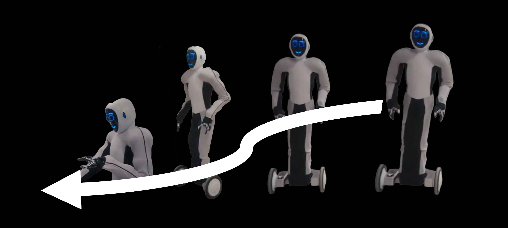

# Walk Through Paintings : Ego-centric World Models from Internet Priors

Anurag Bagchi, Zhipeng Bao, Homanga Bharadhwaj, Yu-Xiong Wang, Pavel Tokmakov, Martial Hebert

[](https://arxiv.org/pdf/2601.15284)
[](http://egowm.github.io/)
[](https://huggingface.co/anuragba/egowm/)



## TODO

- <span style="color: #f4a261;"><strong>[Soon]</strong></span> <span style="color: #60a5fa;"><strong>SCS</strong></span> metric scripts
- <span style="color: #f4a261;"><strong>[Soon]</strong></span> <span style="color: #60a5fa;"><strong>Wan2.1-14B</strong></span> train and infer scripts
- <span style="color: #e9c46a;"><strong>[Very Soon]</strong></span> <span style="color: #60a5fa;"><strong>Cosmos-2B</strong></span> train and infer scripts
- <span style="color: #e9c46a;"><strong>[Very Soon]</strong></span> <span style="color: #60a5fa;"><strong>SVD</strong></span> train and 25-Dof manipulation inference scripts
- <span style="color: #2a9d8f;"><strong>[Done]</strong></span> <span style="color: #60a5fa;"><strong>SVD</strong></span> navigation inference scripts 3-DoF and 25-DoF nav

## Data

### Download and Process 3-DoF Navigation Datasets

#### 1. RECON

- Download the RECON dataset from the [RECON dataset page](https://sites.google.com/view/recon-robot/dataset) and extract it:

```bash
cd data
tar -xzf /mnt/fsx/Anurag/Nav_data/recon/recon_dataset.tar.gz -C recon/
```


#### 2. SCAND/Tartan Drive

- Follow [NWM](https://github.com/facebookresearch/nwm/) to setup SCAND or Tartan Drive
#### 3. Get the splits from [NWM](https://github.com/facebookresearch/nwm/) and save in `data/splits/`

### Download and Process 25-DoF 1x Dataset

- Download the meta zip from [anuragba/egowm](https://huggingface.co/anuragba/egowm/) and extract it into `data/EVE1x/`:

```bash
mkdir -p data/EVE1x
huggingface-cli download anuragba/egowm --repo-type model --local-dir data/EVE1x
unzip data/EVE1x/<meta_zip>.zip -d data/EVE1x/
```

- Download the raw videos from [1x-technologies/world_model_raw_data](https://huggingface.co/datasets/1x-technologies/world_model_raw_data) and place them under `data/EVE1x/`:

```bash
huggingface-cli download 1x-technologies/world_model_raw_data --repo-type dataset --local-dir data/EVE1x
```

<details open>
<summary><span style="font-size: 1.5em;"><strong>Stable Video Diffusion</strong></span></summary>

---

### Install Requirements

Create and activate the conda environment for SVD:

```bash
conda env create -f SVD.yaml
conda activate SVD
```

### Download Weights

#### Pretrained

Download the base model weights from Hugging Face to `<pretrained_pth>`:
[stabilityai/stable-video-diffusion-img2vid-xt](https://huggingface.co/stabilityai/stable-video-diffusion-img2vid-xt)

#### Finetuned w Actions

- Download the finetuned checkpoints from [anuragba/egowm](https://huggingface.co/anuragba/egowm/) into `checkpoints/`:

```bash
mkdir -p checkpoints
huggingface-cli download anuragba/egowm --repo-type model --local-dir checkpoints
```


### 3-DoF Navigation using $[\Delta x, \Delta y, \Delta \phi]$

#### In-Distribution Inference

_Run Inferernce on the Test sets of the 3 in-domain datasets used to train the 3-DoF SVD model._

- **RECON**

  ```bash
  CUDA_VISIBLE_DEVICES=<idx> python3 SVD_3dof_recon_infer.py \
    --pretrained_path <pretrained_pth> \
    --split_root data/splits/ \
    --data_root data/recon/ \
    --num_frames 8 \
    --name_prefix <run_name> \
    --out_dir <output_root> \
    --resume checkpoints/svd_3dof_nav.pth > output.log
  ```

- **SCAND**

  ```bash
  CUDA_VISIBLE_DEVICES=<idx> python3 SVD_3dof_scand_infer.py \
    --pretrained_path <pretrained_pth> \
    --split_root data/splits/ \
    --data_root data/scand/ \
    --num_frames 8 \
    --name_prefix <run_name> \
    --out_dir <output_root> \
    --resume checkpoints/svd_3dof_nav.pth > output.log
  ```

- **Tartan Drive**

  ```bash
  CUDA_VISIBLE_DEVICES=<idx> python3 SVD_3dof_tartan_infer.py \
    --pretrained_path <pretrained_pth> \
    --split_root data/splits/ \
    --data_root data/tartan/ \
    --num_frames 8 \
    --name_prefix <run_name> \
    --out_dir <output_root> \
    --resume checkpoints/svd_3dof_nav.pth > output.log
  ```

#### Painting Inference

_Run Inference on OOD painting scenes using the 3-DoF navigation SVD model. Here we use the test set trajectories of scand or tartan as navigation actions to perform in the painting._

- **Painting Inference (SCAND/Tartan)**

  ```bash
  CUDA_VISIBLE_DEVICES=<idx> python3 SVD_paintings_infer.py \
    --pretrained_path <pretrained_pth> \
    --num_frames 8 \
    --dataset <scand/tartan> \
    --name_prefix <run_name> \
    --out_dir <output_root> \
    --resume checkpoints/svd_3dof_nav.pth \
    > output.log
  ```

## 25-DoF Navigation using EVE 1x Humanoid

#### In-Distribution Inference

_Run inference on the navigation samples in the 1x humanoid 25-DoF validation set._

```bash
CUDA_VISIBLE_DEVICES=<idx> python3 SVD_25dof_nav_1xval.py \
  --num_frames 8 \
  --pretrained_path <pretrained_pth> \
  --name_prefix <run_name> \
  --out_dir <output_root> \
  --resume checkpoints/svd_25dof_nav.pth \
  > output.log
```

#### Real-World Inference

_Run inference on real-world pictures of CMU campus clicked by us._

```bash
CUDA_VISIBLE_DEVICES=<idx> python3 SVD_25dof_nav_realw.py \
  --num_frames 8 \
  --pretrained_path <pretrained_pth> \
  --name_prefix <run_name> \
  --out_dir <output_root> \
  --resume checkpoints/svd_25dof_nav.pth \
  > output.log
```

## 25-DoF Manipulation using EVE 1x Humanoid (Coming Soon)

</details>

<details>
<summary><span style="font-size: 1.5em;"><strong>Cosmos-2B</strong></span></summary>

Coming soon.

</details>

<details>
<summary><span style="font-size: 1.5em;"><strong>Wan-14B</strong></span></summary>

Coming soon.

</details>